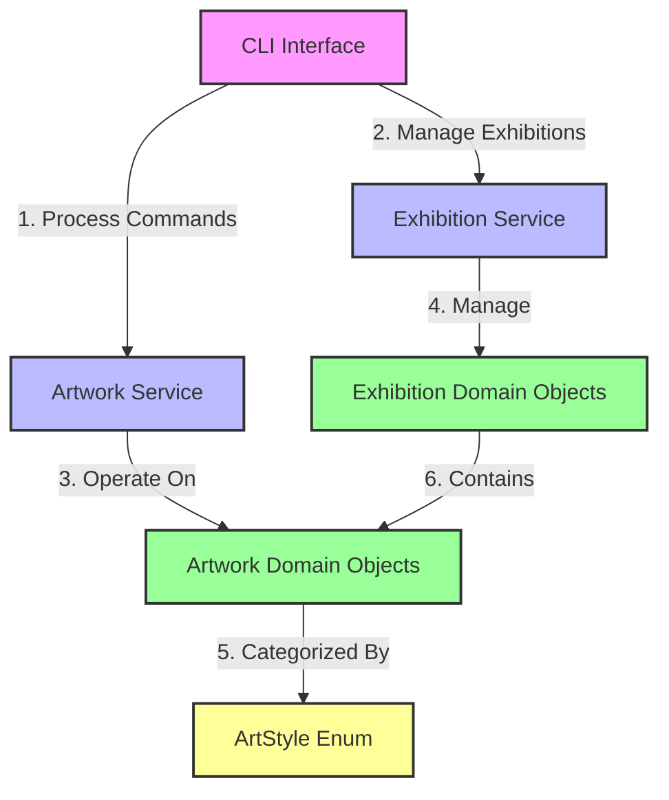
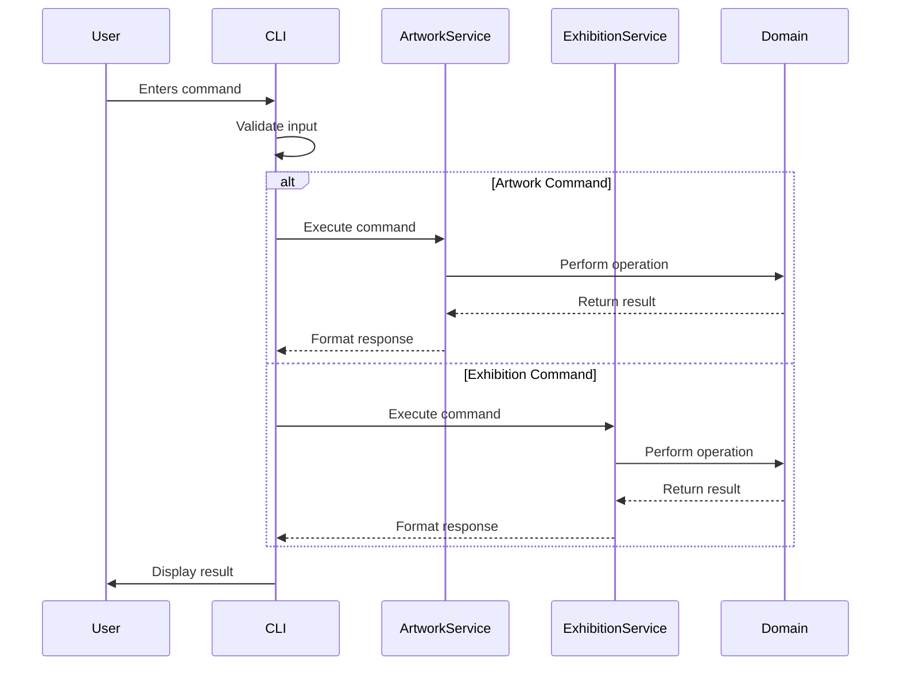
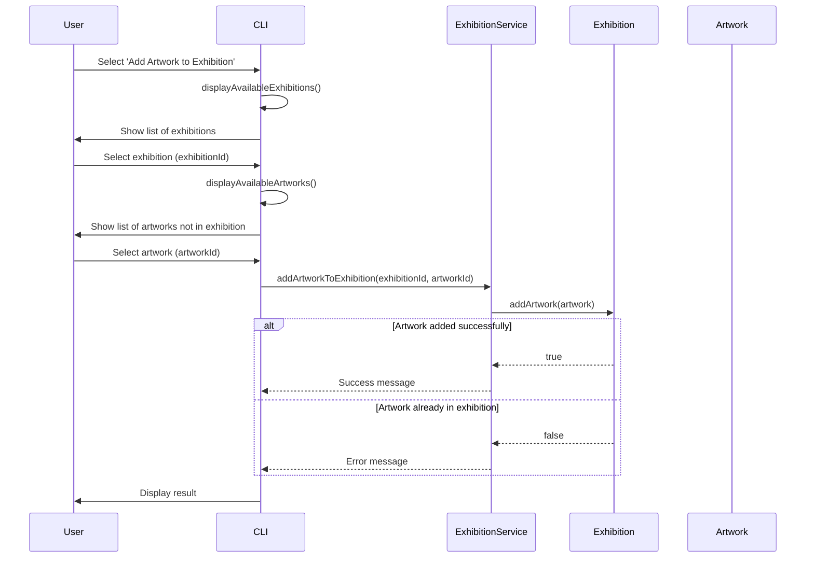

# Art Gallery Management System - Comprehensive Project Report

## Table of Contents
1. [Introduction](#1-introduction)
2. [System Overview](#2-system-overview)
3. [User Stories](#3-user-stories)
4. [Technical Implementation](#4-technical-implementation)
5. [System Architecture](#5-system-architecture)
6. [UML Diagrams](#6-uml-diagrams)
7. [Design Patterns and Principles](#7-design-patterns-and-principles)
8. [Testing Strategy](#8-testing-strategy)
9. [Performance Considerations](#9-performance-considerations)
10. [Future Enhancements](#10-future-enhancements)
11. [Conclusion](#11-conclusion)
12. [Appendix](#12-appendix)

## 1. Introduction

The Art Gallery Management System is a sophisticated Java-based application designed to streamline the management of artworks and exhibitions in modern art galleries. This comprehensive solution addresses the critical needs of gallery administrators, curators, and staff by providing robust tools for cataloging, organizing, and presenting art collections.

### 1.1 Project Objectives
- Develop a maintainable and scalable art gallery management system
- Implement modern Java features and best practices
- Create an intuitive user interface for non-technical staff
- Ensure data integrity and security
- Support various types of artworks and exhibitions
- Enable efficient searching and filtering of the art collection

### 1.2 Target Audience
- Gallery administrators and curators
- Art collection managers
- Exhibition planners
- Gallery staff responsible for inventory management
- Potentially art enthusiasts and researchers (in future versions)

## 3. User Stories

### 3.1 Artwork Management
#### Core Functionality
- **US-001**: As a gallery administrator, I want to add new paintings to the system with details including title, artist, year, style, medium, and framed status.
  - **Acceptance Criteria**:
    - System validates all required fields
    - Medium cannot be empty
    - Year must be a valid year
    - Style must be from predefined list

- **US-002**: As a gallery administrator, I want to add new sculptures with details including title, artist, year, style, material, weight, and dimensions.
  - **Acceptance Criteria**:
    - Weight must be a positive number
    - Material cannot be empty
    - Dimensions must follow standard format (e.g., "HxWxD in cm")

- **US-003**: As a gallery staff member, I want to view a list of all artworks in the gallery.
  - **Acceptance Criteria**:
    - Displays title, artist, and year for each artwork
    - Supports pagination for large collections
    - Can be sorted by different criteria (title, artist, year)

#### Search and Filtering
- **US-004**: As a user, I want to search for artworks by title or artist name.
  - **Acceptance Criteria**:
    - Case-insensitive search
    - Partial matches are supported
    - Results update in real-time as the user types

- **US-005**: As a user, I want to filter artworks by style, year range, and type (painting/sculpture).
  - **Acceptance Criteria**:
    - Multiple filters can be combined
    - Clear visual indication of active filters
    - Option to reset all filters

### 3.2 Exhibition Management
- **US-006**: As a curator, I want to create new exhibitions with a name, description, start date, and end date.
  - **Acceptance Criteria**:
    - Name must be unique
    - End date cannot be before start date
    - Basic validation of all input fields

- **US-007**: As a curator, I want to add multiple artworks to an exhibition.
  - **Acceptance Criteria**:
    - Artworks can be searched and selected from the collection
    - Visual indicator for already selected artworks
    - Option to remove artworks from the exhibition

- **US-008**: As a visitor, I want to view details of upcoming and past exhibitions.
  - **Acceptance Criteria**:
    - Displays exhibition name, dates, and description
    - Shows list of included artworks with thumbnails
    - Responsive layout for different screen sizes

### 3.3 Advanced Features
- **US-009**: As a system administrator, I want the application to use modern Java features for better maintainability.
  - **Acceptance Criteria**:
    - Sealed classes for type safety
    - Pattern matching for cleaner code
    - Records for immutable data
    - Text blocks for better string handling

- **US-010**: As a user, I want the system to handle errors gracefully and provide meaningful feedback.
  - **Acceptance Criteria**:
    - User-friendly error messages
    - No application crashes
    - Logging of errors for technical support

## 4. Technical Implementation

### 4.1 Technology Stack
- **Programming Language**: Java 25 (with preview features)
- **Build Tool**: Maven
- **Version Control**: Git
- **Development Environment**: IntelliJ IDEA
- **Testing Framework**: JUnit 5
- **Documentation**: JavaDoc, Markdown

### 4.2 Key Technical Decisions

#### 4.2.1 Sealed Class Hierarchy
```java
public sealed abstract class Artwork 
    permits Painting, Sculpture {
    // Common artwork properties and methods
}

public final class Painting extends Artwork {
    // Painting-specific implementation
}

public final class Sculpture extends Artwork {
    // Sculpture-specific implementation
}
```

#### 4.2.2 Pattern Matching
```java
public String getArtworkDescription(Artwork artwork) {
    return switch (artwork) {
        case Painting p -> String.format("Painting: %s by %s (%s)", 
            p.getTitle(), p.getArtistName(), p.getMedium());
        case Sculpture s -> String.format("Sculpture: %s by %s (Material: %s)", 
            s.getTitle(), s.getArtistName(), s.getMaterial());
        default -> "Unknown artwork type";
    };
}
```

### 4.3 Error Handling Strategy
- Custom exceptions for domain-specific errors
- Global exception handler for the command-line interface
- Input validation using Java's built-in validation annotations
- Comprehensive logging of errors and important events

## 5. System Architecture

### 5.1 Component Architecture Overview

The Art Gallery Management System follows a layered architecture with clear separation of concerns. This section provides detailed insights into each architectural component and their interactions.

#### 5.1.1 High-Level Component Diagram



### 5.2 Detailed Component Breakdown

#### 5.2.1 CLI Interface (Presentation Layer)
- **Purpose**: Primary user interaction point
- **Key Responsibilities**:
  - Display menus and prompts
  - Capture user input
  - Format and display output
  - Handle basic input validation
  - Route commands to appropriate services
- **Dependencies**:
  - Artwork Service
  - Exhibition Service

#### 5.2.2 Service Layer

##### Artwork Service
- **Purpose**: Centralize artwork-related operations
- **Key Operations**:
  - Create/update/delete artworks
  - Search and filter artworks
  - Validate artwork data
  - Manage artwork lifecycle
- **Dependencies**:
  - Artwork Domain Objects
  - ArtStyle Enum

##### Exhibition Service
- **Purpose**: Manage exhibition-related functionality
- **Key Operations**:
  - Create and manage exhibitions
  - Add/remove artworks from exhibitions
  - Validate exhibition constraints
  - Generate exhibition reports
- **Dependencies**:
  - Exhibition Domain Objects
  - Artwork Domain Objects

#### 5.2.3 Domain Layer

##### Artwork Domain Objects
- **Core Classes**:
  - `Artwork` (abstract base class)
  - `Painting` (concrete implementation)
  - `Sculpture` (concrete implementation)
- **Key Responsibilities**:
  - Maintain artwork state
  - Enforce business rules
  - Calculate derived properties
  - Provide domain-specific behavior

##### Exhibition Domain Objects
- **Core Classes**:
  - `Exhibition` (record)
  - `ExhibitionManager` (manages exhibition lifecycle)
- **Key Responsibilities**:
  - Maintain exhibition state
  - Manage artwork collections
  - Enforce exhibition rules
  - Handle date validations

#### 5.2.4 Supporting Elements

##### ArtStyle Enum
- **Purpose**: Standardize artwork categorization
- **Values**:
  - IMPRESSIONISM
  - SURREALISM
  - ABSTRACT
  - RENAISSANCE
  - MODERN
- **Features**:
  - Type-safe style references
  - Display name formatting
  - Style validation

### 5.3 Component Interactions

#### 5.3.1 Command Flow Sequence



#### 5.3.2 Data Flow

1. **Artwork Creation Flow**:
   - User provides artwork details through CLI
   - CLI validates basic input format
   - Artwork Service validates business rules
   - Domain object is created and persisted
   - Success/failure message returned to user

2. **Exhibition Management Flow**:
   - User creates/updates exhibition
   - Exhibition Service validates constraints
   - Domain objects are updated
   - Related artworks are associated
   - Confirmation returned to user

### 5.4 Architectural Patterns

#### 5.4.1 Layered Architecture
1. **Presentation Layer (CLI)**:
   - Handles I/O operations
   - Formats output for display
   - Routes user commands

2. **Service Layer**:
   - Implements use cases
   - Coordinates domain objects
   - Enforces business rules

3. **Domain Layer**:
   - Contains business logic
   - Maintains domain state
   - Enforces domain rules

4. **Infrastructure Layer**:
   - Provides technical capabilities
   - Handles cross-cutting concerns
   - Manages external integrations

#### 5.4.2 Design Principles Applied

1. **Single Responsibility Principle (SRP)**:
   - Each class has one reason to change
   - Clear separation of concerns

2. **Dependency Inversion Principle (DIP)**:
   - High-level modules don't depend on low-level ones
   - Both depend on abstractions

3. **Open/Closed Principle (OCP)**:
   - Open for extension
   - Closed for modification

4. **Interface Segregation Principle (ISP)**:
   - Small, focused interfaces
   - Clients only depend on what they use

### 5.5 Benefits of This Architecture

1. **Maintainability**:
   - Clear separation of concerns
   - Easy to locate and modify features
   - Reduced side effects from changes

2. **Testability**:
   - Components can be tested in isolation
   - Mock implementations for dependencies
   - Clear input/output contracts

3. **Scalability**:
   - New features can be added with minimal impact
   - Components can be scaled independently
   - Easy to replace implementations

4. **Flexibility**:
   - UI can be replaced without changing business logic
   - Business rules can evolve independently
   - Easy to add new artwork types or features

## 6. UML Diagrams

### 6.1 Complete Class Diagram

```mermaid
classDiagram
    %% Artwork Hierarchy
    class Artwork {
        <<sealed>>
        #String title
        #String artistName
        #int yearCreated
        #ArtStyle style
        #double price
        #LocalDate dateAdded
        +String getTitle()
        +String getArtistName()
        +int getYearCreated()
        +ArtStyle getStyle()
        +double getPrice()
        +void setPrice(double)
        +String getArtType()
        +String getStyleName()
        +int getAge()
        +String getDescription()
    }
    
    class Painting {
        -String medium
        -boolean isFramed
        +String getMedium()
        +boolean isFramed()
        +void setFramed(boolean)
        +String getArtType()
        +String getDescription()
    }
    
    class Sculpture {
        -String material
        -double weight
        -String dimensions
        +String getMaterial()
        +double getWeight()
        +String getDimensions()
        +String getArtType()
        +String getDescription()
    }
    
    %% Exhibition
    class Exhibition {
        <<record>>
        -String name
        -LocalDate startDate
        -LocalDate endDate
        -Set~Artwork~ artworks
        +String name()
        +LocalDate startDate()
        +LocalDate endDate()
        +Set~Artwork~ artworks()
        +boolean addArtwork(Artwork)
        +boolean removeArtwork(Artwork)
        +boolean containsArtwork(Artwork)
        +List~Artwork~ getArtworksByStyle(ArtStyle)
        +long getArtworkCount()
        +boolean isCurrent()
    }
    
    %% Enums
    class ArtStyle {
        <<enum>>
        IMPRESSIONISM
        SURREALISM
        ABSTRACT
        RENAISSANCE
        MODERN
        +String getDisplayName()
    }
    
    %% Relationships
    Artwork <|-- Painting
    Artwork <|-- Sculpture
    Exhibition "1" -- "*" Artwork : contains >
    Artwork "*" -- "1" ArtStyle : has >
    
    %% Styling
    classDef abstractClass fill:#f9f,stroke:#333,stroke-width:2px
    classDef concreteClass fill:#9f9,stroke:#333,stroke-width:2px
    classDef enumClass fill:#ff9,stroke:#333,stroke-width:2px
    
    class Artwork abstractClass
    class Painting, Sculpture, Exhibition concreteClass
    class ArtStyle enumClass
```

### 6.2 Sequence Diagram: Adding an Artwork to Exhibition



## 7. Design Patterns and Principles

### 7.1 Design Patterns Used

#### Factory Method Pattern
```java
public abstract class Artwork {
    // Factory method
    public static Artwork createWithCurrentDate(String title, String artistName, 
            int yearCreated, ArtStyle style, String type) {
        LocalDate currentDate = LocalDate.now();
        return switch (type.toLowerCase()) {
            case "painting" -> new Painting(title, artistName, yearCreated, style, "Oil");
            case "sculpture" -> new Sculpture(title, artistName, yearCreated, style, "Bronze", 0, "0x0x0");
            default -> throw new IllegalArgumentException("Unknown artwork type: " + type);
        };
    }
}
```

#### Builder Pattern (for complex object creation)
```java
public class ArtworkBuilder {
    private String title;
    private String artistName;
    private int yearCreated;
    private ArtStyle style;
    private double price;
    
    public ArtworkBuilder setTitle(String title) {
        this.title = title;
        return this;
    }
    
    // Other builder methods...
    
    public Artwork build() {
        return new Artwork(title, artistName, yearCreated, style, price);
    }
}
```

### 7.2 SOLID Principles

1. **Single Responsibility Principle (SRP)**:
   - Each class has a single responsibility
   - Separate classes for different types of artworks
   - Dedicated service classes for business logic

2. **Open/Closed Principle (OCP)**:
   - Open for extension through inheritance and interfaces
   - Closed for modification by using sealed classes

3. **Liskov Substitution Principle (LSP)**:
   - Subtypes can be used interchangeably with their base types
   - All subclasses maintain the contract of the parent class

4. **Interface Segregation Principle (ISP)**:
   - Small, focused interfaces
   - Clients only depend on methods they use

5. **Dependency Inversion Principle (DIP)**:
   - High-level modules don't depend on low-level modules
   - Both depend on abstractions

## 8. Testing Strategy

### 8.1 Unit Testing
- **Test Classes**:
  - `ArtworkTest`
  - `PaintingTest`
  - `SculptureTest`
  - `ExhibitionTest`
  - `ArtGalleryUtilsTest`

### 8.2 Integration Testing
- Test interactions between components
- Database integration tests (future)
- File I/O operations (future)

### 8.3 Test Coverage Goals
- Minimum 80% line coverage
- 100% branch coverage for critical paths
- Edge case testing for all public methods

## 9. Performance Considerations

### 9.1 Memory Management
- Use of immutable objects where possible
- Efficient collection usage
- Lazy loading for large datasets (future)

### 9.2 Time Complexity
- O(1) for artwork lookup by ID
- O(n) for searching by title/artist (could be optimized with indexing)
- O(1) for adding/removing artworks from exhibitions (using HashSet)

## 10. Future Enhancements

### 10.1 Short-term Goals
1. **Persistence Layer**:
   - SQLite for local storage
   - JPA/Hibernate for ORM
   - Database migration scripts

2. **Enhanced Reporting**:
   - PDF report generation
   - Export to Excel/CSV
   - Visual analytics dashboard

3. **User Management**:
   - Role-based access control
   - User authentication
   - Audit logging

### 10.2 Medium-term Goals
1. **Web Interface**:
   - Spring Boot backend
   - React/Vue.js frontend
   - Responsive design

2. **API Development**:
   - RESTful API
   - Swagger/OpenAPI documentation
   - Rate limiting and authentication

3. **Advanced Features**:
   - Image recognition for artwork identification
   - Virtual exhibition tours
   - Mobile app integration

### 10.3 Long-term Vision
- AI-powered artwork recommendations
- Blockchain for provenance tracking
- AR/VR exhibition experiences
- Integration with art market data

## 11. Conclusion

The Art Gallery Management System represents a robust, modern Java application that effectively demonstrates advanced language features while providing practical functionality for art gallery management. The system's architecture is designed for maintainability, scalability, and extensibility.

Key achievements include:
- Successful implementation of Java 25 preview features
- Clean, maintainable code following SOLID principles
- Comprehensive error handling and input validation
- Intuitive command-line interface
- Strong foundation for future enhancements

## 12. Appendix

### 12.1 Code Examples
#### Pattern Matching with Switch Expressions
```java
public String getArtworkInfo(Artwork artwork) {
    return switch (artwork) {
        case Painting p && p.isFramed() -> 
            String.format("Framed painting: %s (%s)", p.getTitle(), p.getMedium());
        case Painting p -> 
            String.format("Unframed painting: %s (%s)", p.getTitle(), p.getMedium());
        case Sculpture s -> 
            String.format("Sculpture: %s (Material: %s, Weight: %.2f kg)", 
                s.getTitle(), s.getMaterial(), s.getWeight());
        default -> "Unknown artwork type";
    };
}
```

### 12.2 Dependencies
```xml
<dependencies>
    <!-- JUnit 5 for testing -->
    <dependency>
        <groupId>org.junit.jupiter</groupId>
        <artifactId>junit-jupiter-api</artifactId>
        <version>5.9.0</version>
        <scope>test</scope>
    </dependency>
    
    <!-- Future Dependencies -->
    <!-- 
    <dependency>
        <groupId>org.hibernate.orm</groupId>
        <artifactId>hibernate-core</artifactId>
        <version>6.0.0.Final</version>
    </dependency>
    -->
</dependencies>
```

### 12.3 Build and Run Instructions
```bash
# Clone the repository
git clone https://github.com/yourusername/art-gallery-management-system.git
cd art-gallery-management-system

# Compile with Java 25
find src -name "*.java" > sources.txt
javac --enable-preview --release 25 -d target/classes @sources.txt

# Run the application
java --enable-preview -cp target/classes com.artgallery.GalleryApp
```

### 12.4 Known Issues and Workarounds
1. **Java 25 Preview Features**: 
   - Requires `--enable-preview` flag
   - Some IDEs may require additional configuration

2. **Limited Error Recovery**:
   - Some operations may require restarting the application on error
   - Future versions will include more robust error recovery

3. **Performance with Large Collections**:
   - Current implementation loads all artworks into memory
   - Future versions will implement pagination and lazy loading
